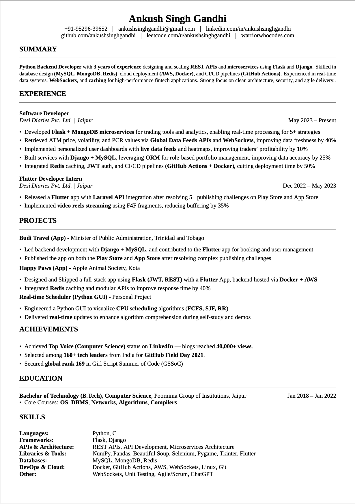

<a href="https://warriorwhocodes.com"></a>

<p align="center">
  <a href="https://ankushsinghgandhi.github.io">
    
  </a>
  <a href="http://twitter.com/ankushsgandhi">
    
  </a>
   <a href="https://www.linkedin.com/in/ankush-singh-gandhi-2487771aa/">
    
  </a>
  <a href="https://dev.to/@ankushsinghgandhi">
    
  </a>
  <a href="https://stackoverflow.com/users/13790266/ankush-singh">
    
  </a>
  <a href="https://leetcode.com/ankushsinghgandhi/">
    
  </a>
    <a href="https://www.hackerrank.com/ankushsgandhi">
    
  </a>
    <a href="https://www.hackerearth.com/@bhanusinghank">
    
  </a>
</p>


# ASG ATS Resume Template (LaTeX)

📄 A clean, one-page, ATS-friendly **resume template** built with LaTeX.  
Designed for software developers, engineers, and tech professionals who want a professional-looking resume with **perfect alignment, section separators, and consistent formatting**.  

---

## ✨ Features
- **One-page layout** – recruiter-friendly and ATS-readable  
- **Minimalist design** – no clutter, no unnecessary graphics  
- **Tinos font** (requires XeLaTeX or LuaLaTeX)  
- **Thin section dividers** for clear separation  
- **Bold section titles & project names**  
- **Custom macros** for sections, job lines, and consistent bullet formatting  
- **Overleaf-ready** and GitHub-hosted  

---

## 📂 Files
- `resume.tex` → Main LaTeX source file  
- `resume.pdf` → Example compiled resume  
- `template.tex` → Blank version with placeholders (`Company Name`, `Project Title`, etc.)  
- `LICENSE` → MIT License (free to use and adapt)  

---

## 🚀 How to Use

### Option 1: Overleaf
1. Open [Overleaf](https://overleaf.com/)  
2. Create a new project → "Upload Project"  
3. Upload the `.tex` file (and optional `.pdf` preview)  
4. Compile with **XeLaTeX** or **LuaLaTeX**  

### Option 2: Local (TeX Live / MikTeX)
```bash
# Compile with XeLaTeX
xelatex resume.tex
````

---

## 🛠️ Customization

* **Header**: Replace name, phone, email, LinkedIn, GitHub, etc.
* **Sections**: Modify `\Section{}` commands for *Summary, Experience, Projects, Skills...*
* **Spacing**: Adjust `\renewcommand{\baselinestretch}{}` and list item spacing in preamble.
* **Font**: Change `\setmainfont{Tinos}` to any system font (requires XeLaTeX).

---

## 📸 Preview



*(Screenshot of the compiled PDF)*

---

## 📜 License

This project is licensed under the **MIT License** – feel free to use, modify, and share.

---

## 🙌 Credits

Created by [Ankush Singh Gandhi](https://warriorwhocodes.com/)
Published on **GitHub** + **Overleaf** for the community 🚀
